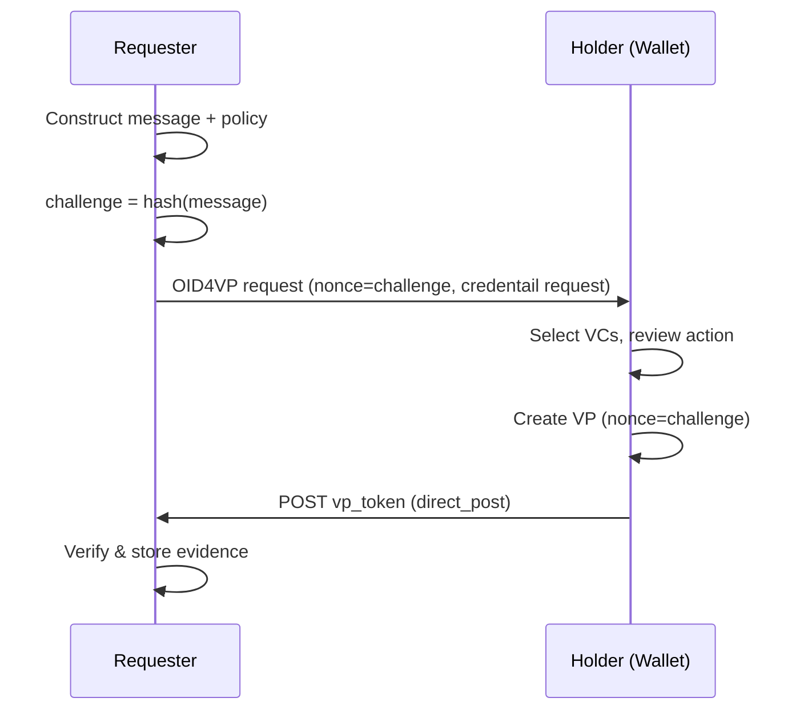

## Abstract

This specification defines a protocol for generating and verifying cryptographic evidence of user consent in the ENVITED-X Data Space.
It uses Verifiable Presentations (VPs) via OID4VP as the evidence format, binding consent to a specific action through a challenge-response mechanism.
The protocol enables services to act on behalf of users (e.g., for example, submitting blockchain transactions or finalizing contracts) while providing independently verifiable proof that the user authorized the action.

## Motivation

In the ENVITED-X Data Space, services frequently need to perform actions on behalf of users because users cannot directly perform these actions themselves with their SSI wallet.
A provider system may need to submit a blockchain transaction to list an asset, or issue a credential on behalf of a user.
In all cases, the service requires provable consent from the user before acting.

Traditional approaches require users to hold and manage blockchain-specific keys.
In a Verifiable Credential ecosystem, however, users already hold credentials in SSI wallets and authenticate via OpenID-based flows.
Requiring additional key management imposes unnecessary complexity and fragments the user experience.

This specification addresses the delegation problem by reusing the OID4VP protocol that users already interact with.
Users provide consent with their existing SSI wallet — no blockchain key management is needed.
The resulting evidence is a cryptographic artifact that:

- **Binds consent to a specific action** through a deterministic challenge derived from the message describing the action.
- **Is independently verifiable** by any party with access to the evidence, without requiring contact with the original Requester.
- **Serves as a tamper-proof audit trail** that can be stored and verified at any later point.
- **Supports privacy-preserving disclosure** when SD-JWT VCs are used, allowing Holders to present only the claims required.

The protocol is designed to be reusable across ENVITED-X processes.

## Specification

### 1. Evidence

Evidence is cryptographic proof that a specific user consented to a specific action.
At minimum, evidence consists of the following components:

- A **message** describing the action the user is consenting to.
- A **challenge** deterministically derived from that message via cryptographic hash function.
- A **signature object** proving the user saw and approved the message identified by the challenge.

The challenge binds the signature object to the message.
Any modification to the message produces a different challenge, invalidating existing signature objects.
This ensures that consent cannot be transferred from one action to another.

Three roles are involved in the evidence lifecycle:

- **Requester**: The service that needs evidence of user consent for a specific action (e.g., to execute a blockchain transaction on the user's behalf). The Requester initiates the evidence request.
- **Holder**: The user whose consent is captured. The Holder reviews the action and approves or rejects the request.
- **Verifier**: Any party that checks whether a piece of evidence is valid.

The Requester and Verifier MAY be the same party or different parties.

The message format is not prescribed by this specification.
Implementations SHOULD include at minimum:

- A human-readable description of the action
- A domain or origin identifying the Requester
- A unique nonce ensuring the message is not reused
- A timestamp indicating when the message was created

[EIP-4361 (Sign-In with Ethereum)](https://eips.ethereum.org/EIPS/eip-4361) provides inspiration for structured message formats that include these elements.

Future EVES MAY define additional evidence types with different signature objects and challenge derivation mechanisms.

### 2. VP-Based Evidence

This specification defines the first concrete evidence type using Verifiable Presentations:

- The **challenge** is the cryptographic hash of the serialized message (e.g., `SHA-256(serialize(message))`).
- The **signature object** is a Verifiable Presentation (VP) where the challenge is embedded in the VP's `nonce` or challenge field.
- The VP contains one or more Verifiable Credentials (VCs) proving the Holder's identity and attributes.

The VC format is not prescribed.
SD-JWT VCs (see [SD-JWT-based Verifiable Credentials](https://www.ietf.org/archive/id/draft-ietf-oauth-sd-jwt-vc-00.html)) are RECOMMENDED because selective disclosure allows Holders to redact unnecessary claims, minimizing personal data contained in the evidence.
Other VC formats conforming to the [W3C Verifiable Credentials Data Model](https://www.w3.org/TR/vc-data-model/) are also valid.

All VP formats include a challenge field (commonly `nonce`) that can carry the message hash.
This is the binding mechanism that ties the VP to the specific action.

A key advantage of VP-based evidence is that the VP can include VCs carrying authorization-related data.
For example, a VC might prove that the Holder's key is affiliated with a specific organization, or that the Holder holds a particular role.
This means evidence does not just prove consent — it proves _authorized_ consent.
The Requester communicates what VCs are needed as part of the standard OID4VP flow.

### 3. Evidence Creation Flow

#### 3.1 Abstract Flow

1. The Requester constructs a **message** describing the action and a **policy** specifying acceptable credentials.
2. A **challenge** is derived from the message.
3. The challenge and policy are presented to the Holder.
4. The Holder reviews the action and decides to approve or reject.
5. If approved, the Holder produces a **signature object** bound to the challenge.
6. The signature object is returned to the Requester, completing the evidence.

#### 3.2 VP-Based Flow Using OID4VP

The following sequence describes the VP-based evidence creation flow using [OpenID for Verifiable Presentations (OID4VP)](https://openid.net/specs/openid-4-verifiable-presentations-1_0.html):

1. The Requester displays a **message**, the **challenge** derived form it, and a way to verify this challenge. He also provides an OID4VP Authorization Request. Usually via QR-Code.
2. The Holder ingests the request and his wallet downloads the request object containing the **challenge** and requested VCs.
3. The Holder selects matching VCs, reviews the challenge, and provides consent.
4. The wallet creates a VP with the challenge as the `nonce` and submits it via `direct_post` to the Requester.
5. The VP is stored as evidence by the requester and may be used to trigger further actions.

### 4. Evidence Verification

#### 4.1 Abstract Verification

A Verifier MUST confirm the following for evidence to be considered valid:

1. The **signature object** was produced by the claimed Holder.
2. The **signature object** is bound to the claimed message via the challenge.
3. The **credential requirements** specified in the policy are met.

If any of these checks fail, the evidence MUST be considered invalid.

#### 4.2 VP-Based Verification

For VP-based evidence, the Verifier MUST perform the following checks:

1. **VP signature verification**: The VP signature is verified against the Holder's DID (see [W3C Decentralized Identifiers](https://www.w3.org/TR/did-core/)).
2. **Credential verification**: Each VC inside the VP is independently verified, including issuer signature validation and format-specific integrity checks.
3. **VC requirement check**: The VCs in the VP satisfy the requirements that the Requester specified in the OID4VP request.
4. **Challenge binding**: The VP's `nonce` MUST equal `hash(message)`. This binds the evidence to the specific action.
5. **Holder verification** (OPTIONAL): If a specific Holder was expected, the VP subject MUST match the expected Holder's identifier.

If any check fails, the evidence MUST be considered invalid.

### 5. Security Considerations

- **Replay prevention**: Each message MUST include a unique nonce, ensuring that the derived challenge is unique per action. This prevents a signature object from being replayed for a different action with an identical message.
- **Message integrity**: The deterministic hash binding between message and challenge ensures that any modification to the message invalidates the evidence.
- **Time-bounding**: Implementations SHOULD set an expiration on evidence requests to prevent stale requests from being fulfilled after an unreasonable delay.
- **Holder binding**: The Requester MAY specify an expected Holder. If specified, the Verifier MUST check that the VP subject matches the expected Holder.
- **Policy immutability**: The policy associated with an evidence request MUST NOT be modified after the request is created. Changing the policy after the Holder has consented would invalidate the relationship between what was requested and what was approved.
- **Transport security**: OID4VP requests and responses MUST be transmitted over TLS. Implementations SHOULD use signed authorization requests to prevent tampering.
- **Credential freshness**: Verifiers SHOULD check the revocation status of presented VCs.

### 6. Privacy Considerations

- **Minimal disclosure**: Policies SHOULD request only the claims necessary for the specific action. Over-requesting claims exposes unnecessary personal data.
- **Selective disclosure with SD-JWT VCs**: When SD-JWT VCs are used, Holders present only the claims required by the policy. All other claims are redacted from the presentation. This is the RECOMMENDED approach for new implementations.
- **Storage protection**: Stored evidence contains credential data and MUST be protected with appropriate access controls. Access to stored evidence SHOULD be limited to authorized parties on a need-to-know basis.

## Backwards Compatibility

This specification introduces a new protocol and does not modify any existing EVES.
It is compatible with the existing VC, DID, and wallet infrastructure described in [EVES-002](../EVES-002/eves-002.md).

## References

1. **EVES-001**: [ENVITED-X Ecosystem Specification Process](../EVES-001/eves-001.md)
2. **EVES-002**: [ENVITED-X Data Space Architecture Overview](../EVES-002/eves-002.md)
3. **OpenID for Verifiable Presentations (OID4VP)**: [Specification](https://openid.net/specs/openid-4-verifiable-presentations-1_0.html)
4. **W3C Verifiable Credentials Data Model**: [Specification](https://www.w3.org/TR/vc-data-model/)
5. **W3C Decentralized Identifiers (DIDs)**: [Specification](https://www.w3.org/TR/did-core/)
6. **EIP-4361 (Sign-In with Ethereum / SIWE)**: [Specification](https://eips.ethereum.org/EIPS/eip-4361)
7. **RFC 2119**: [Key words for use in RFCs to Indicate Requirement Levels](https://www.rfc-editor.org/rfc/rfc2119)
8. **SD-JWT-based Verifiable Credentials**: [Specification](https://www.ietf.org/archive/id/draft-ietf-oauth-sd-jwt-vc-00.html)

## Implementation

An initial implementation is planned for the [ENVITED-X Data Space](https://staging.envited-x.net).
