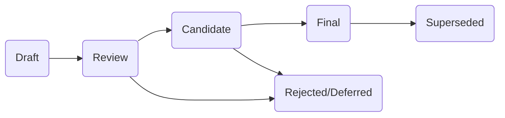

## Abstract

This document establishes the formal process for creating, editing, and approving ENVITED Ecosystem Specifications (EVES).
It describes how proposals progress through Draft, Review, Candidate, and Final stages, as well as how they may be Deferred or Rejected.
By defining clear entry/exit criteria, governance roles, and reference implementation requirements, this specification aligns the ENVITED-X Data Space with best practices for open standards.

## Motivation

The ENVITED Ecosystem depends on shared standards and specifications to ensure interoperability, security, and transparency.
EVES-001 provides a clear, consensus-driven path for developing new specifications and revising existing ones.
Without a well-defined process, proposals can stall, consensus may be ambiguous, and implementation quality can suffer.

## Specification

### 1. EVES Lifecycle

This section defines the stages an EVES must pass through, along with entry/exit criteria and outcomes.

### 1.1 Visual Overview

### 1.2 EVES Lifecycle Stages

Each EVES must pass through the following stages:

1. **Draft**  
   - Created via a Pull Request (PR).  
   - Must follow the [EVES template](https://github.com/ASCS-eV/EVES/blob/main/EVES/resources/eves-template.md) and meet the requirements in the [Style Guide](https://github.com/ASCS-eV/EVES/blob/main/EVES/resources/style-guide.md).  
   - Open for initial community feedback.

2. **Review**:
   - EVES Editors confirm compliance with required format (see Section 6 "Format").  
   - Community discusses proposal (GitHub issues, PR reviews).  
   - **Exit Criteria**: At least two Editor approvals + no unresolved blocking objections.

3. **Candidate**:
   - Must include or reference a working proof of concept (Reference Implementation) demonstrating feasibility.  
   - Community tests and refines details; any remaining concerns are addressed.  
   - **Exit Criteria**: A stable implementation exists, and Approvers confirm readiness for final vote.

4. **Final**  
   - The EVES is officially adopted.  
   - **Future Changes**: Only changes designated as a minor editorial update by Editors are allowed in this stage.

5. **Deferred/Rejected**  
   - **Deferred**: The EVES is paused for future discussion (e.g., lack of resources, overshadowed by another proposal).  
   - **Rejected**: Consensus cannot be reached, or the specification is fundamentally misaligned with ENVITED-X goals.

6. **Superseded**  
   - A necessary major change to a **Final** EVES will result in a new **Draft** document with a unique identifier.
   - With the new EVES document reaching the **Final** state the predecessor receives the status **Superseded**.

### 1.3 Entry/Exit Criteria Example

| **Stage**    | **Entry**                                                                  | **Exit**                                                                             |
|--------------|----------------------------------------------------------------------------|--------------------------------------------------------------------------------------|
| **Draft**    | PR opened; Adheres to template & style guide                               | Meets minimal clarity & format → **Review**                                          |
| **Review**   | Editors confirm formatting; Community feedback in progress                 | ≥ 2 Editor approvals + no blocking objections → **Candidate**                        |
| **Candidate**| Working reference implementation; Feasibility tested                       | Approvers confirm readiness → **Final** (if no further changes needed)               |
| **Final**    | Officially adopted                                                         | Major change → New EVES draft; Minor clarifications → Direct merges allowed          |
| **Deferred** | N/A                                                                        | Revisited later by Authors/Editors when new progress is possible                     |
| **Rejected** | N/A                                                                        | Terminal stage for unresolvable proposals                                            |

### 2. EVES Numbering

- EVES documents follow sequential numbering, starting from EVES-001, EVES-002, and so on.  
- Numbers must be unique and stable once assigned (i.e., no recycling of identifiers).

### 3. EVES Types

Each EVES must declare one of the following **type** fields in its YAML header:

1. **Standards**  
   - Defines technical specifications or protocols recommended for ecosystem adoption (e.g., data formats, APIs).

2. **Informational**  
   - Provides context, best practices, or reference material without strict normative requirements.

3. **Process**  
   - Outlines procedural or governance rules applicable to the ENVITED community (e.g., this EVES-001).

### 4. Roles and Responsibilities

### 4.1 Author

- Any individual or group drafting an EVES.
- Responsible for preparing the initial text, updating it based on feedback, and ensuring final clarity.

### 4.2 Community

- All ENVITED stakeholders who participate in discussions and reviews, typically via GitHub issues and pull requests.

### 4.3 EVES Editors

- Oversee editorial reviews and confirm compliance with EVES format and style requirements.  
- Remain neutral on technical content but ensure clarity, correctness, and adherence to process.  
- Governed by [EVES-004 (Roles and Responsibilities of EVES Editors)](../EVES-004/eves-004.md).

### 4.4 Approvers

- A subset of EVES Editors with voting rights as full ASCS e.V. ENVITED members.  
- Provide the final decision on moving an EVES from Candidate to Final.  
- Must meet quorum requirements (e.g., at least two Approvers) to grant or deny Final status.

### 4.5 Conflict Resolution

- If consensus cannot be reached at the Review or Candidate stage, Editors may escalate to an ASCS ENVITED TSC or finally an ASCS board vote.  
- Authors can appeal Editor or Approver decisions by opening a dedicated issue in the repository with justification.

## 5. Reference Implementation

- **Requirement**: An EVES **MUST** demonstrate feasibility via a reference implementation before progressing from Review to Candidate.  
- **Open/Closed Source**: An open-source example is strongly **RECOMMENDED**, though a closed-source reference is acceptable if sufficiently documented.  
- **Community Validation**: Users are encouraged to test the reference implementation for real-world interoperability and consistency with the EVES specification.

## 6. Format

All EVES documents **MUST** follow the structure below:

1. **Header (YAML)**  
   - eves-identifier, title, author, discussions-to, status, type, created, requires, replaces  
2. **Abstract**  
   - Brief summary (2–3 sentences) of the EVES.  
3. **Motivation**  
   - Context and explanation of why this EVES is needed.  
4. **Specification**  
   - Detailed technical or procedural requirements.  
5. **Lifecycle**  
   - If relevant, describe states or phases unique to this EVES.  
6. **Backwards Compatibility**  
   - Explain how this proposal interacts with existing implementations, if any.  
7. **References**  
   - List any relevant RFCs, W3C standards, or other external specs.

EVES must use [RFC 2119](https://www.rfc-editor.org/rfc/rfc2119) key words ("MUST," "SHOULD," "RECOMMENDED," etc.) appropriately for normative statements.

## 7. Revisions to Final EVES

- Once an EVES reaches **Final** status, significant changes **MUST** be submitted via a new EVES draft.  
- Editors will determine if proposed changes are major (functionality-altering) or minor (typos, clarifications).  

## 8. Governance

ENVITED-X emphasizes openness, inclusivity, and accountability. Discussions, votes, and final decisions regarding EVES are publicly visible on GitHub. Detailed governance rules, especially regarding EVES Editors, can be found in [OpenMSL Governance Rules](https://openmsl.github.io/doc/OpenMSL/organization/governance_rules.html).

## 9. Backwards Compatibility

This process introduces new clarity regarding EVES stages, references, and roles without invalidating earlier procedures. Existing EVES in Draft need not restart unless their authors or Editors decide to re-align them with these updated guidelines.

## 10. References

1. **EVES-004: Roles and Responsibilities of EVES Editors**  
   [https://github.com/ASCS-eV/EVES/blob/main/drafts/EVES-004/EVES-004.md](https://github.com/ASCS-eV/EVES/blob/main/EVES/drafts/EVES-004/eves-004.md)

2. **RFC 2119: Key Words for Use in RFCs to Indicate Requirement Levels**  
   [https://www.rfc-editor.org/rfc/rfc2119](https://www.rfc-editor.org/rfc/rfc2119)

3. **EVES Template & Style Guide**  
   [../resources/](https://github.com/ASCS-eV/EVES/tree/main/EVES/resources)

4. **OpenMSL Governance Rules**  
   [https://openmsl.github.io/doc/OpenMSL/organization/governance_rules.html](https://openmsl.github.io/doc/OpenMSL/organization/governance_rules.html)
